# DesmoSAT – 모듈형 캔위성 하드웨어 (2023)

> 모듈화를 통해 **저비용·고유연성**을 달성한 소형 위성 하드웨어 플랫폼  
> 공통 코어 + 교체식 임무 보드 + 착륙 보드 = 빠른 재사용/응용

<!-- 히어로: 실물 사진 준비 전, 회로도 콜라주로 임시 노출 -->
<!-- 실물 사진을 올리면 아래 경로로 교체: docs/images/hero-boards.png -->
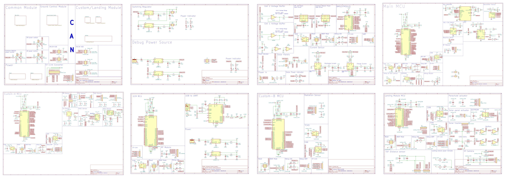

## 개요
DesmoSAT은 **모듈 교체만으로 임무를 바꿀 수 있게 설계된 캔위성(CanSat) 하드웨어 플랫폼**입니다.  
공통 코어(Common)와 전력/배터리 관리(BMS), 임무 모듈(Custom A/B), 착륙 모듈(Landing)을 단일 **CAN 2.0B** 버스로 연결하고, **전원·통신·ST-Link가 표준화된 인터페이스**로 제공되어 보드를 ‘플러그인’처럼 교체하면 즉시 재사용이 가능합니다.  
이 구조는 설계 변경 범위를 최소화해 **개발 기간을 단축**하고 **반복 제작 비용을 절감**하며, 현장 운용 중에도 유지보수와 확장을 쉽게 합니다.  
데모 임무로는 **화산 위험 징후 탐지**(가스/분진, IR/VL, ToF 기반)를 구현했습니다.

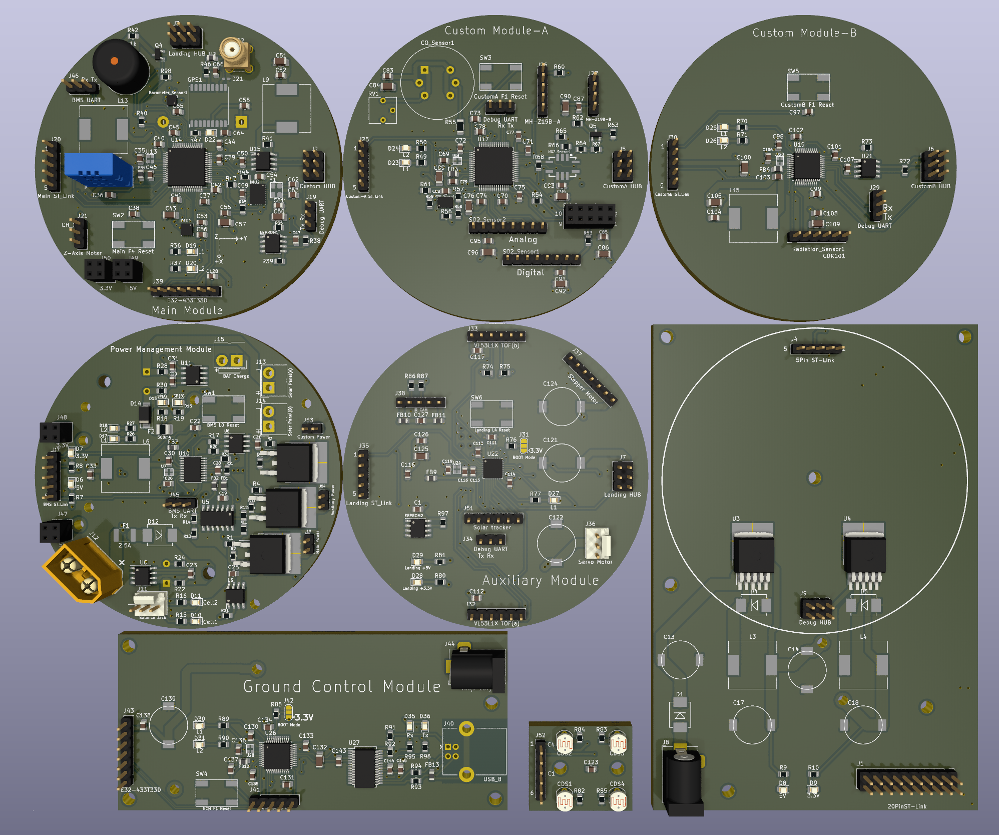

## 핵심 포인트
- **모듈 스왑 기반 임무 전환**: 공통 코어는 유지, 임무 보드만 교체 → 빠른 재활용/확장  
- **표준화된 인터페이스**: 전원·CAN·ST-Link 핀아웃 통일 → 설계/디버그 일관성 확보  
- **개발/운용 효율**: 변경 영향 범위 축소 → 개발 기간 단축, 반복 제작·정비 비용 절감  
- **데모 임무**: 화산 위험 징후 탐지(가스/분진 + IR/VL + ToF), 군사 동향 정찰 위성(방사능 센서 + IR/VL + ToF)

> 설계/출력 도구: **KiCad 8/9** 

---

## 모듈 구조

| 모듈 | 목적(키워드) | 핵심 부품(키워드) |
|---|---|---|
| **Common** | 비행 컴퓨터/통신/센서 허브 | STM32F4, CAN(SN65HVD231), RF(433 MHz 1 W), GPS(MAX-M10S), IMU(BNO085/ICM-20602), Baro(LPS22HB), EEPROM |
| **Battery & BMS** | 전원/충전/안전 관리 | STM32L0, LM2596S 5 V/3.3 V, INA219B(전류), LM324A(셀버퍼), TC427(파워 게이팅), Solar 입력 |
| **Custom A** | 화산 임무용 가스/분진 센싱 | STM32F4, SO₂/CO/CO₂/CH₄/TVOC/PM 센서, CAN, TCXO |
| **Custom B** | 방사선 임무(확장) | STM32F1, GDK101(방사선), CAN, TCXO |
| **Landing** | 낙하/착지/추적 | STM32L4, VL53L1X(ToF), IR/VL 카메라 I/F, CDS 트래커, 서보/스테퍼, CAN |
| **Ground Control** | 지상국 수신/표시 | STM32F1, RF(E32-433T30D), FT232RL(USB-UART) |

<!-- 블록 다이어그램(상위 시트) 스크린샷 -->
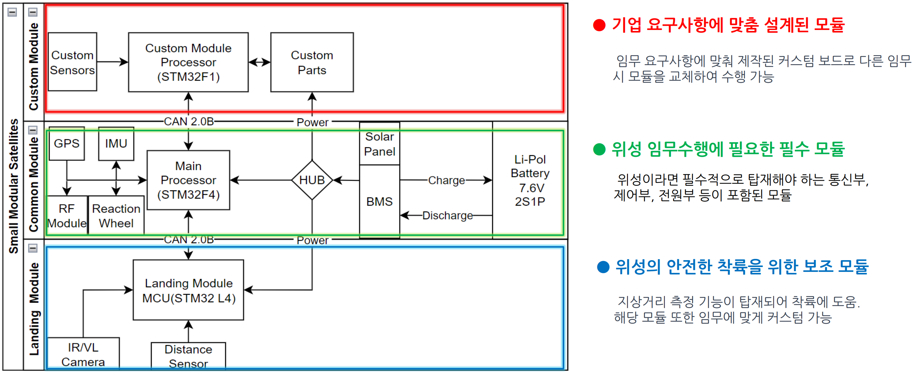

---

## 데모 임무 A: 화산 위험 징후 탐지
  활화산의 불안 징후를 감지하여 해당 화산의 폭발이 임박했는지 데이터를 지속
해서 Logging 하여 화산이 폭발하기 전 지역 주민이 대피할 수 있도록 하는 위성
이다.
  해당 캔 위성에는 화산에서 분출되는 다양한 가스의 농도를 측정해주는 모듈이
장착되어 화산 상공에서 낙하하며 각 가스의 농도를 측정한다. 그 후 착륙 모듈에
장착된 VL, IR 카메라를 사용하여 화산 상공의 모습과 화산지역의 온도를 측정한
다. 그 후 비교적 온도가 낮은 지역으로 낙하산 줄을 조정하여 착륙을 유도하고 착
륙한 뒤에는 메인 모듈에 내장된 IMU를 사용하여 화산지역의 지진파를 지속해서
측정한다.
  마지막으로 각 모듈에서 수집된 데이터를 기반으로 메인 컴퓨터가 화산 분화 가
능성을 대략 연산한 뒤 각 센서 수치와 함께 안전한 곳에 있는 지상국으로 데이터
를 보내주어 지질학자가 해당 데이터를 정밀 분석하여 해당 화산의 분화 가능성을
최종적으로 산출할 수 있다.

- **Custom A**: 하강 중 **SO₂/CO/CO₂/CH₄/TVOC/PM** 연속 측정 → 패킷 전송  
- **Landing**: **IR/VL 이미지**로 열점/지형 파악, **ToF**로 지면 거리 → **낙하산 라인 제어**(더 안전/저온 지역으로 착지 유도)  
- **Common**: 착지 후 **IMU 기반 미소진동(지진파) 모니터링**, RF 링크로 지상국에 로그 전송  
- **지상국**: 실시간 그래프/지도화, **베이스라인 대비 변화량** 분석

<!-- Custom A: 실물 사진 준비 전, 회로도 이미지 임시 노출 -->
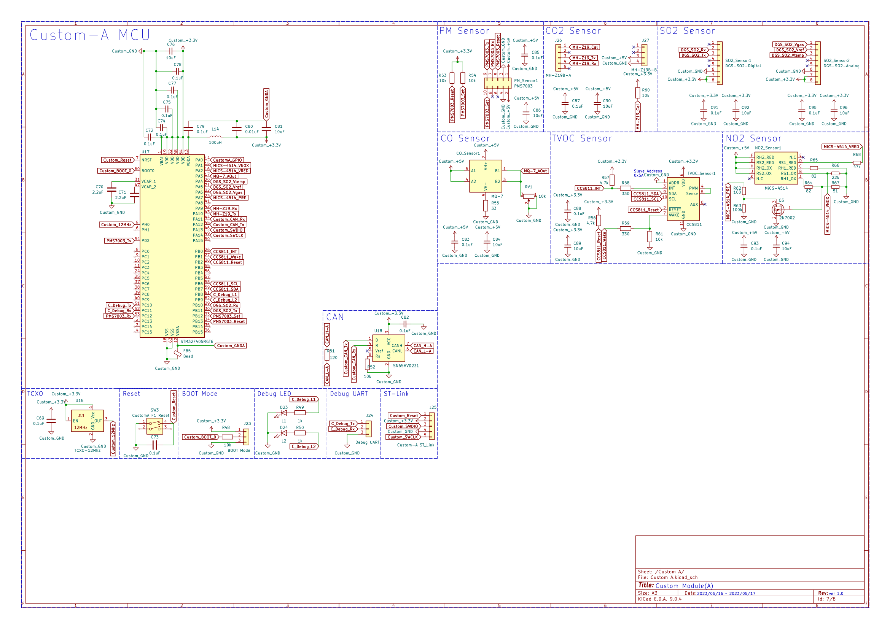


## 데모 임무 B: 군사 동향 정찰 위성
  적국의 핵실험 유무 및 국사적 움직임을 관측하기 위해 최상단 모듈을 방사능
측정 센서와 풍향 풍속 센서가 장착된 모듈로 교체한 뒤 캔 위성을 발사하여 핵실
험 유력 장소 상공 방사능 농도를 측정한다. 동시에 착륙 모듈에 장착된 IR/VL 카
메라를 사용하여 지표의 온도, 이미지를 보고 핵실험 유무를 판단할 수 있다.
  착륙한 뒤에는 화산 위험 징후 감지 위성과 동일하게 메인 모듈에 내장된 IMU
를 사용하여 지진파를 지속해서 감지하기 때문에 추가적인 핵실험 여부도 판단할
수 있는 위성이다. 
  또한 같은 위성을 원전 사고 현장에 발사한다면 방사성 물질의
피해 범위를 산출할 수도 있다

- **Custom B**: 하강 중 **방사능 농도** 연속 측정 → 패킷 전송  
- **Landing**: **IR/VL 이미지**로 열점/지형 파악, **ToF**로 지면 거리 → **낙하산 라인 제어**(목표 지역으로 유도 및 핵실험 유무 판단)  
- **Common**: 착지 후 **IMU 기반 미소진동(지진파) 모니터링**, RF 링크로 지상국에 로그 전송(추가 핵실험 판단)
- **지상국**: 실시간 그래프/지도화, **베이스라인 대비 변화량** 분석

<!-- Custom B: 실물 사진 준비 전, 회로도 이미지 임시 노출 -->
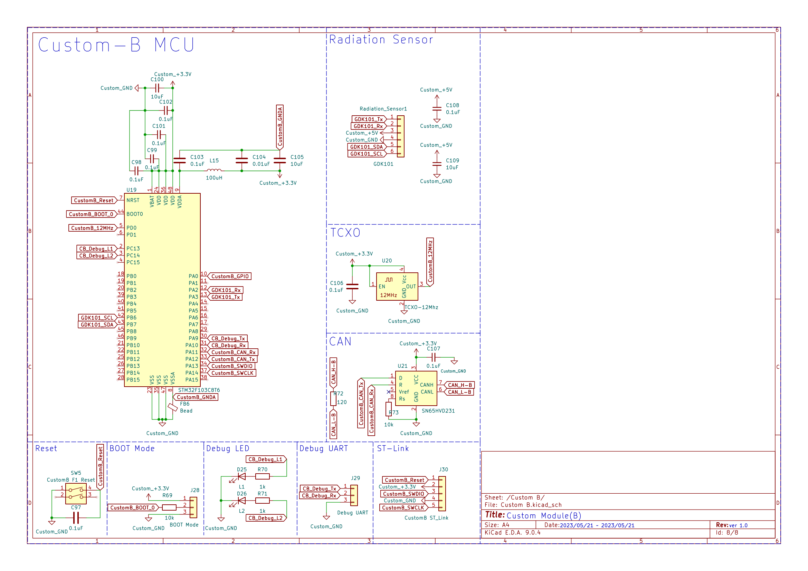

---

## 시스템 개요

### 통신/제어
- **CAN 2.0B**: 모듈 간 명령·텔레메트리 버스
- **RF 433 MHz 1 W**: 지상국 링크(센서/상태/좌표)
- **ST-Link**: 전 모듈 SWD 디버그/펌웨어 업데이트

### 전원/충전
- **Li-Po 2셀 + BMS**: 저전압 보호/전류 모니터/모듈 파워게이팅
- **스위칭 레귤레이터**: LM2596S-5/-3.3 (효율), 디버그 전원 레일 분리
- **Solar 충전**: 배터리 레벨에 따라 모듈 **절전/복귀** 제어

### 센서/액추에이터
- **가스/분진**: SO₂, CO, CO₂, CH₄, TVOC, PM
- **IMU**: BNO085(9축), ICM-20602(6축)
- **GPS**: MAX-M10S
- **CDS Solar Tracker**: 4-셀 + LM324A 버퍼
- **ToF**: VL53L1X
- **IR/VL 카메라**, **리액션 휠**, **스테퍼(낙하산)**, **서보(패널)**

---

## 회로도 이미지

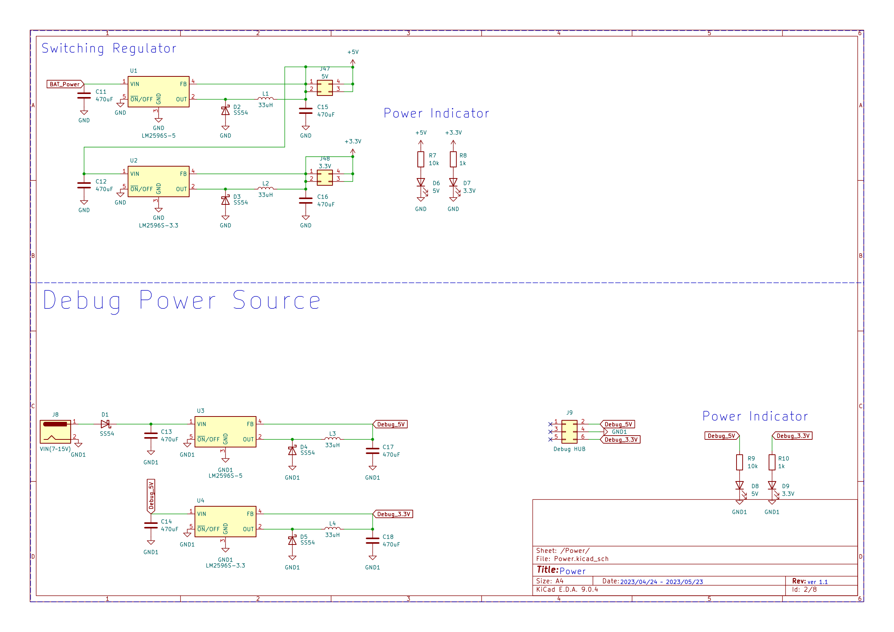
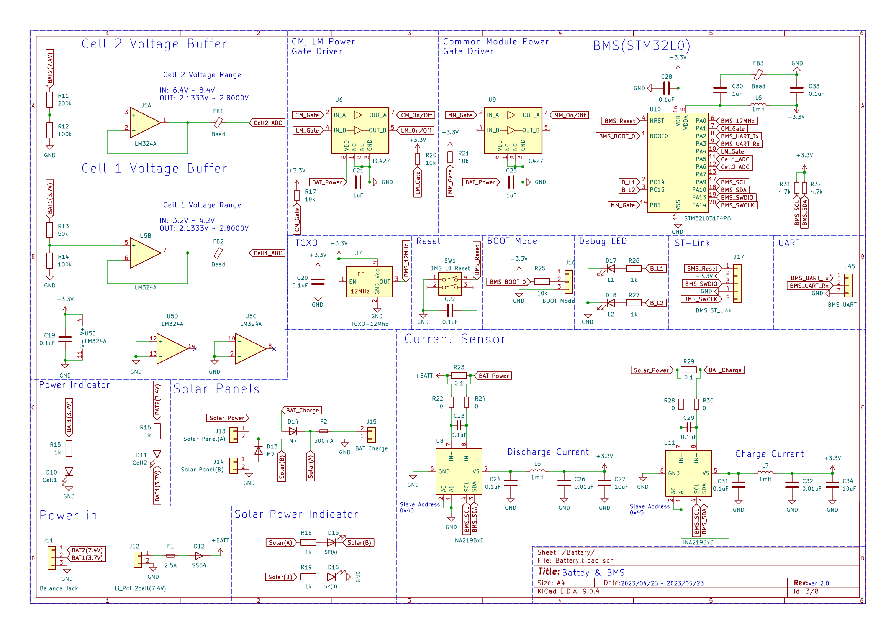
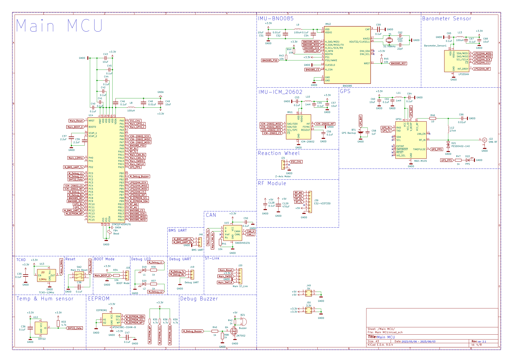


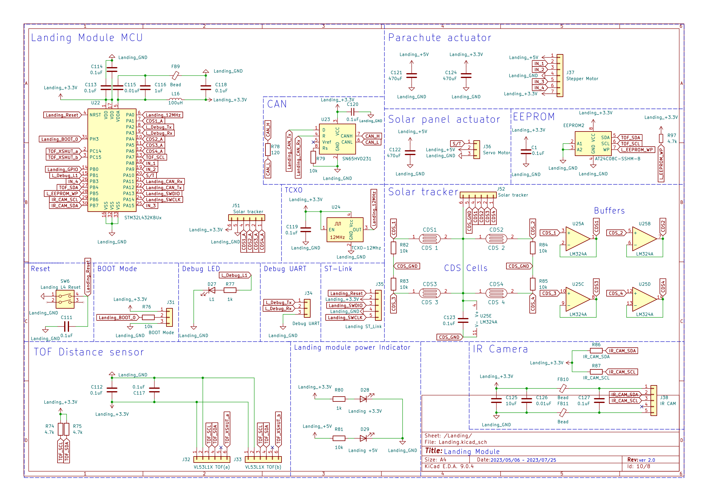
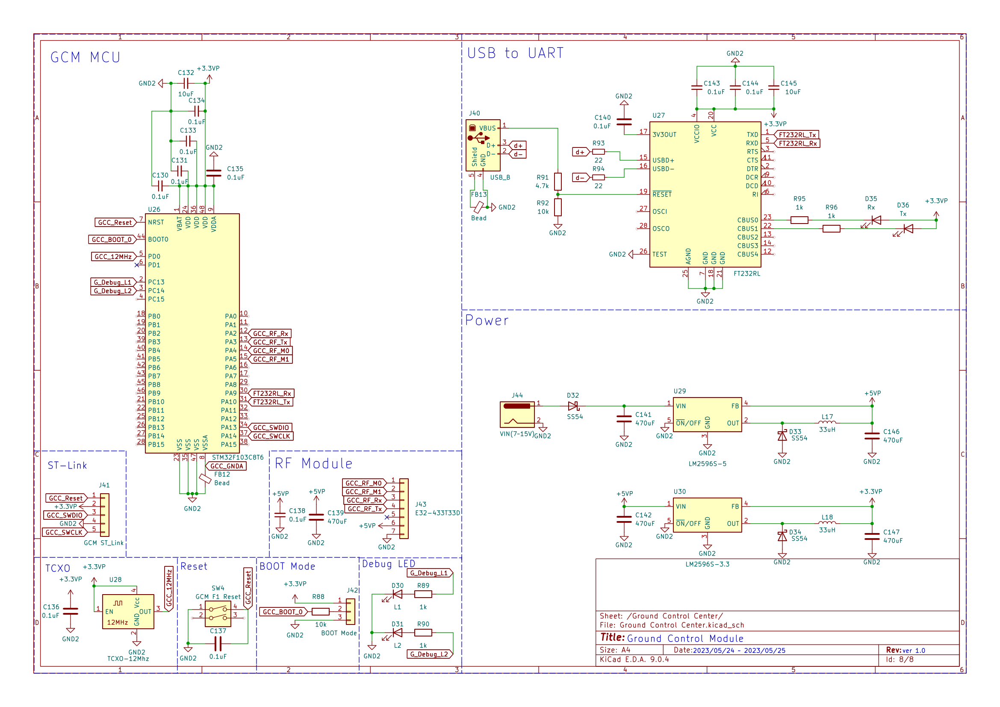
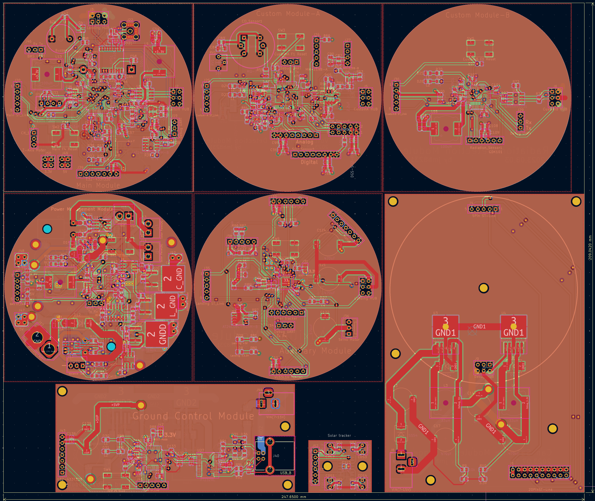

---

## 하드웨어 이미지 (실물 사진 업로드 후 노출)

> 실물 보드/PCB 이미지를 준비하면 아래 **파일명 그대로** 올리면 됩니다.  
> 올리는 즉시 README가 자동으로 해당 이미지를 표시합니다.

<!-- 히어로 실물 합성 -->
<!-- 올릴 파일: docs/images/hero-boards.png -->

<!-- Common -->
<!-- 올릴 파일: docs/images/common-top.png, docs/images/common-pcb.png -->

<!-- Battery & BMS -->
<!-- 올릴 파일: docs/images/bms-top.png, docs/images/bms-pcb.png -->

<!-- Custom A (센서 라벨 강조판 권장) -->
<!-- 올릴 파일: docs/images/custom-a-board.png, docs/images/custom-a-sensors-labeled.png -->

<!-- Custom B -->
<!-- 올릴 파일: docs/images/custom-b-top.png -->

<!-- Landing -->
<!-- 올릴 파일: docs/images/landing-top.png, docs/images/landing-pcb.png -->

<!-- Ground Control -->
<!-- 올릴 파일: docs/images/gcs-top.png -->

---

## 파일/폴더 구조

```text
desmosat-hw-2023/
├─ common_module/        # 메인 MCU, CAN, 센서, RF
├─ battery_bms/          # 배터리/충전/BMS
├─ custom_module_a/      # 가스/분진 페이로드
├─ custom_module_b/      # 방사선 페이로드(옵션)
├─ landing_module/       # 낙하/착륙(서보/스테퍼/ToF/카메라)
├─ ground_control/       # 지상국 MCU + RF + USB
├─ docs/
│  ├─ images/            # README 이미지(.png/.jpg)
│  └─ schematics/        # (옵션) 회로 캡처 원본
└─ fabrication/          # Gerber/Drill/PnP/Assembly 자료
